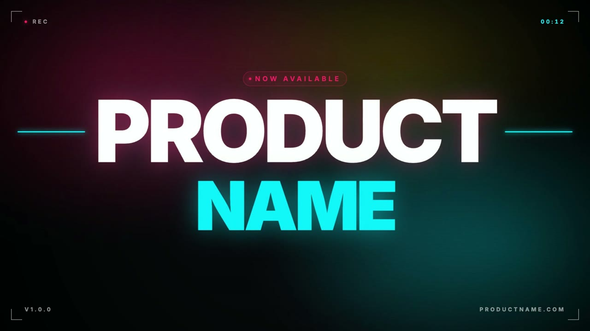

# hyperframes-trailer-demo

A 103.6-second, 1920×1080 beat-synced product trailer built with [HyperFrames](https://hyperframes.heygen.com). Seven scenes choreographed to an action-trailer rock soundtrack — intro, title drop, three feature scenes, pricing, outro. Every scale pulse, flash, shake, and color burst lands on a beat extracted by `librosa`.

This is a sample / reference project. The product is fictional.

## Watch the trailer

<video src="https://github.com/rmichak/hyperframes-trailer-demo/releases/download/v1.0.0/trailer.mp4" controls poster="docs/thumbnail.jpg" width="100%"></video>

[](https://github.com/rmichak/hyperframes-trailer-demo/releases/download/v1.0.0/trailer.mp4)

▶ **[Download trailer.mp4](https://github.com/rmichak/hyperframes-trailer-demo/releases/download/v1.0.0/trailer.mp4)** — 39 MB, 1080p30, 1:43. Hosted as a [GitHub Release asset](https://github.com/rmichak/hyperframes-trailer-demo/releases/tag/v1.0.0) (GitHub's web view can't display files this large inline; the release CDN can).

<sub>Frame above is from the peak hit at 12.1s.</sub>

## Get the music

The composition expects a file named `soundtrack.mp3` at the project root. It is **not** included in this repo (Pixabay's license discourages redistributing tracks as standalone files).

Download it yourself — it's free:

1. Track: **"Action trailer promo rock"** by **MagpieMusic** on Pixabay
2. Search Pixabay music: <https://pixabay.com/music/search/action%20trailer%20promo%20rock/> — the MagpieMusic track (ID **513687**, 1:43)
3. Save the file as `soundtrack.mp3` in this project root.

Pixabay's content license allows free commercial and non-commercial use. Credit appreciated; not required.

If you swap in a different soundtrack, re-run the beat analysis (see below) and adjust scene boundaries in `index.html` to match the new `segment_boundaries`.

## Run it

```bash
npm run dev       # Studio preview at http://localhost:3002/#project/product-test
npm run check     # lint + validate + inspect
npm run render    # render to MP4 (writes to renders/)
```

The Studio hot-reloads when you edit `index.html`.

## Beat analysis pipeline

```bash
python3 -m venv .venv
.venv/bin/pip install librosa
.venv/bin/python scripts/analyze.py soundtrack.mp3 > analysis.json
```

`analysis.json` contains: tempo (161.5 BPM for the default track), beat times, beat energies, onset times, and `segment_boundaries` from agglomerative chroma segmentation — the seven scene boundaries (0, 6.4, 16.7, 36.9, 59.1, 72.2, 97.7) come straight from this file.

## Project layout

```
index.html         single-file composition (all 7 scenes, ~500 lines)
soundtrack.mp3     (not committed — see "Get the music")
analysis.json      librosa beat analysis output
scripts/analyze.py librosa wrapper that produces analysis.json
CLAUDE.md          AI agent guidance (architecture, conventions, gotchas)
hyperframes.json   HyperFrames project config
meta.json          project metadata
```

## How the scenes are timed

| Scene | Window      | What happens                                                      |
| ----- | ----------- | ----------------------------------------------------------------- |
| s1    | 0 – 6.4s    | intro, wordmark letter-stagger on first kick at 0.77s             |
| s2    | 6.4 – 16.7s | title smash at 6.6s, peak hit at 12.1s (color burst + shake)      |
| s3    | 16.7 – 36.9s | Feature 1: speed gauge counter 0 → 187 ms                        |
| s4    | 36.9 – 59.1s | Feature 2: 3 stat cards (12M / 99.99% / 5000+)                   |
| s5    | 59.1 – 72.2s | Feature 3: testimonial, 5-star pop, logo wall                    |
| s6    | 72.2 – 97.7s | Pricing tiers, Pro card pulses every beat, CTA breathing         |
| s7    | 97.7 – 103.6s | Outro: gradient wordmark, triple fade to black                  |

## Credits

- Music: [Action trailer promo rock](https://pixabay.com/) by MagpieMusic via Pixabay
- Framework: [HyperFrames](https://hyperframes.heygen.com) by HeyGen
- Beat detection: [librosa](https://librosa.org/)
- Animation: [GSAP](https://gsap.com/)

## License

MIT — see code. The soundtrack is licensed separately under Pixabay's terms; download it yourself per the instructions above.
